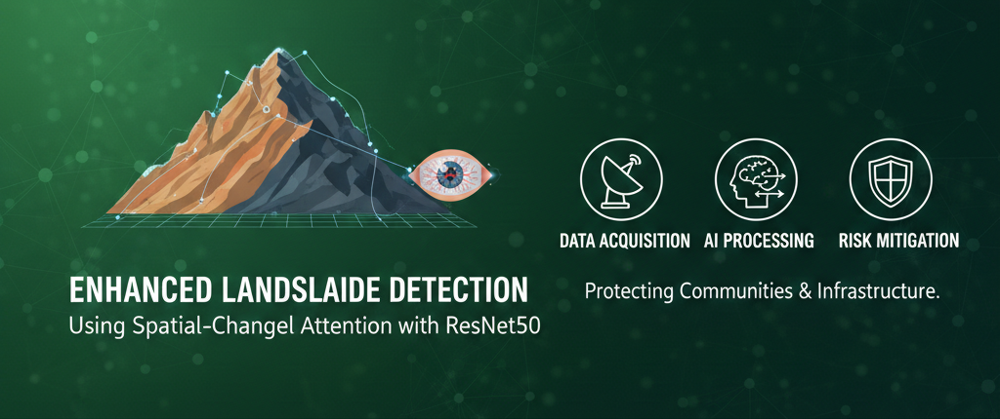
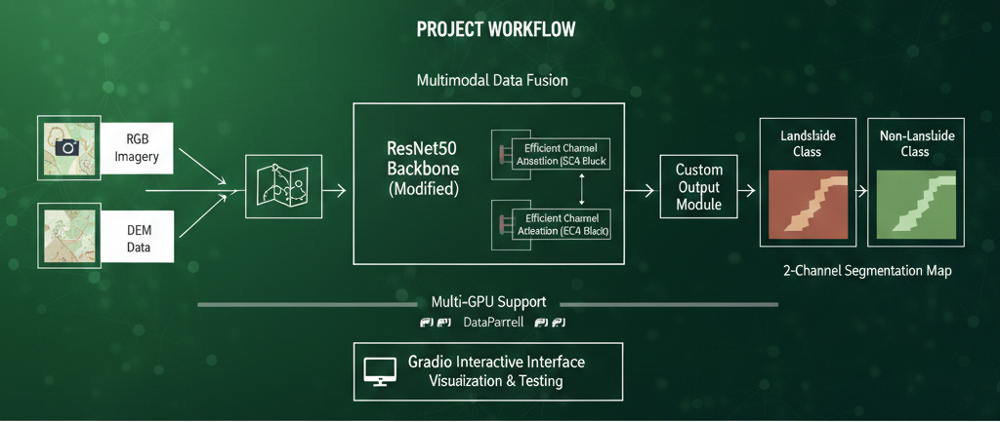
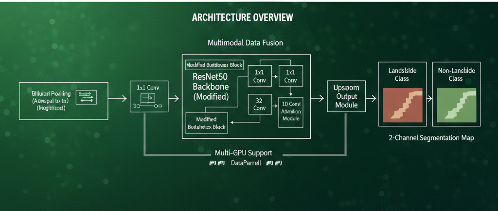
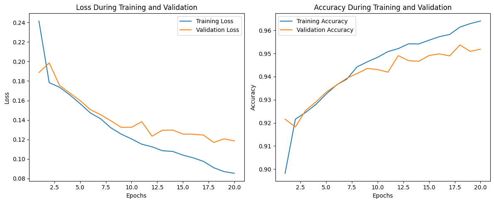
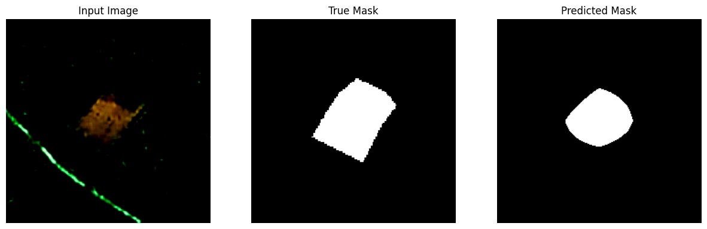

<!-- ...existing code... -->

# Enhanced Landslide Detection Using Spatial-Channel Attention with ResNet50

## Project Overview
This project implements an advanced semantic segmentation approach for detecting landslides in satellite imagery combined with Digital Elevation Model (DEM) data. The model uses a modified ResNet50 enhanced by Efficient Channel Attention (ECA) to improve detection across complex terrains.

## Key Features
- Multimodal data fusion (RGB + DEM)
- Efficient Channel Attention integrated into ResNet50 bottlenecks
- Custom output module producing 2-channel segmentation maps (landslide vs non-landslide)
- Gradio-based interactive interface for visualization and testing
- Multi-GPU support via DataParallel

## Dataset (summary)
Bijie Landslide Dataset from Kaggle (hanstankman). Dataset includes RGB images, DEM files, segmentation masks, and polygon coordinates. Images are resized to 224×224 and combined as 4-channel input (RGB + DEM). Typical split used: ~67% training / 33% validation.

## Architecture (summary)
- ECA Attention: channel-wise weighting via global pooling and lightweight 1D convolution
- Bottleneck blocks: 1×1, 3×3, 1×1 convs with ECA applied
- ResNet50 backbone with modified bottlenecks and channel attention
- Upsampling module: bilinear upsampling to input resolution and channel reduction to 2 output channels

## Input Processing & Augmentation
- RGB images normalized with ImageNet statistics
- DEM normalized to a suitable range (e.g., -1 to 1)
- Early fusion by concatenating RGB and DEM into a 4-channel tensor
- Basic augmentation: random horizontal flips and resizing to 224×224

## Training & Evaluation (summary)
- Loss: Cross-Entropy for segmentation
- Optimizer: Adam with a small learning rate (example settings commonly used)
- Typical batch sizes: use GPU memory-aware settings (e.g., 2–8)
- Validation split: ~33%
- Monitor training/validation loss and accuracy; adjust learning rate or batch size for stability

## Results & Visualizations
- Reported validation accuracy ~91%+
- Model parameter count: approximately 23.5M (ResNet50 + ECA)
- Produces side-by-side visual comparisons: input image, ground-truth mask, predicted mask

## Installation & Setup (notes)
- Requires Python 3.8+ and a compatible CUDA for GPU acceleration if used
- Typical dependencies: PyTorch, torchvision, OpenCV/Pillow, NumPy, Matplotlib, scikit-learn, Gradio (install via pip or conda)
- Use Kaggle API to download dataset if needed and ensure credentials are configured

## Project Structure (summary)
Enhanced_Landslide_Detection repository contains model code, notebooks, requirements, and outputs such as trained_model.pth, loss curves, and prediction samples.

## Troubleshooting (common)
- CUDA OOM: reduce batch size
- Dataset issues: verify Kaggle credentials and file paths
- Slow loading: adjust DataLoader num_workers

## References
- ResNet: He et al., "Deep Residual Learning for Image Recognition" (2015)
- ECA-Net: Wang et al., "ECA-Net: Efficient Channel Attention for Deep Convolutional Neural Networks" (2020)
- Bijie Landslide Dataset on Kaggle

## Citation
If you use this project, please cite the project and the dataset accordingly (author: Maqsood, 2024).

## License
Provided for educational and research purposes.

## Author
Maqsood — Specialization: Deep Learning, Computer Vision, Geospatial Analysis

**Last Updated**: February 2, 2026  
**Status**: Active Development

<!-- ...existing code... -->